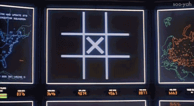

# Tic Tac Toe



```WOULDN'T YOU RATHER PLAY A NICE GAME OF CHESS?```

This is a command-line [Tic Tac Toe](https://en.wikipedia.org/wiki/Tic-tac-toe) game in which you are pitted against the WOPR (War Operations Planned Response) computer, inspired by the 1983 Cold War film [WarGames](https://en.wikipedia.org/wiki/WarGames).

## Instructions

Simply execute the Python script in this repository, or for the lazy, run the following one-liner `curl` command:

```sh
python <(curl -s https://raw.githubusercontent.com/aanari/tic-tac-toe/master/tic_tac_toe.py)
```

**Note**: The game board is numbered 1 - 9, starting from the bottom left corner.

```
                          |     |
                       7  |  8  |  9
                          |     |
                     -----------------
                          |     |
                       4  |  5  |  6
                          |     |
                     -----------------
                          |     |
                       1  |  2  |  3
                          |     |
```
